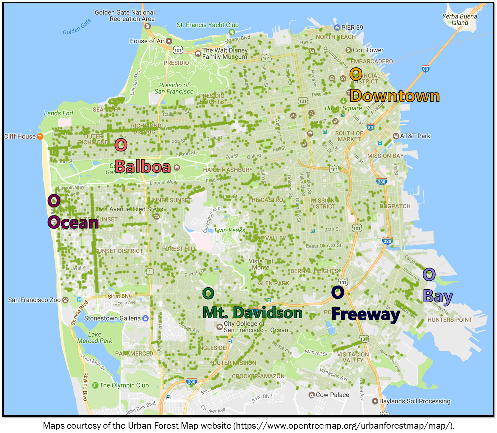

```{r setup, include=FALSE}
knitr::opts_chunk$set(echo = FALSE, message = FALSE, warning = FALSE)
```

```{r load-libraries}
# load libraries
library("dplyr")
library("tidyr")
library("vegan")
library("ggplot2")
library("tidyverse")
library("ggpubr")
```

```{r read-in-data}
# load files
otus <- read.table("seq_with_OTU_ID.txt")
groups <- read.table("groupfile.tsv")
trees <- read.csv("metadata/M_excel_tree_metadata_with_isolationfreq.csv",
                  stringsAsFactors = FALSE)
TBAS <- read.csv("metadata/TBAS_taxonomies.csv")
culturing <- read.csv("metadata/culturing_worksheet.csv")
extractions <- read.csv("metadata/Extraction_worksheet.csv")

# count by groups instead of trees
otu_table <- otus %>%
  left_join(groups, by = c("V1" = "V1")) %>%
  group_by(V2.x, V2.y) %>%
  summarize(count = n()) %>%
  spread(V2.x, count, fill = 0)

# get rid of rows with NA
otu_table <- as.data.frame(na.omit(otu_table))

# fix row name problems for vegan
row.names(otu_table) <- otu_table[, 1]
otu_table <- otu_table[, -1]

# drop out USF test sample
otu_table <- otu_table[1:30,]
```

# Abstract

In natural and agricultural systems, the plant microbiome —the microbial organisms associated with plant tissues—has been shown to have important effects on host physiology and ecology, yet we know little about how these plant-microbe relationships play out in urban environments. Here we characterize the composition of fungal communities associated with leaves of one of the most common sidewalk trees in the city of San Francisco, California. We focus our efforts on endophytic fungi (asymptomatic microfungi that live inside healthy leaves), which have been shown in other systems to have large ecological effects on the health of their plant hosts. Specifically, we characterized the foliar fungal microbiome of Metrosideros excelsa trees growing in a variety of urban environmental conditions. We used high-throughput culturing, PCR, and Sanger sequencing of the ITS nrDNA region to quantify the composition and structure of fungal communities growing within healthy leaves of 30 M. excelsa trees from 6 distinct sites, which were selected to capture the range of environmental conditions found within city limits. Sequencing resulted in 1044 high-quality ITS sequences. These sequences clustered into 97 Operational Taxonomic Units (97% VSEARCH OTUs). We found that these communities encompass relatively high alpha (within) and beta (between-site) diversity. Multivariate statistical analyses (NMDS, PERMANOVA) showed that fungal community composition was significantly different between sites (PERMANOVA p = 0.001). Since the communities are all from the same host tree species, and located in relatively close geographical proximity to one another, these analyses suggest that urban environmental factors such as urban heat islands or differences in traffic density (and associated air quality) could potentially be influencing the composition of these fungal communities. We are performing additional analyses to quantify how urban abiotic and anthropogenic factors may shape the composition of these trees' endophytic microbiomes. These biogeographic patterns provide evidence that plant microbiomes in urban environments can be as dynamic and complex as their natural counterparts. As human populations continue to transition out of rural areas and into cities, understanding the factors that shape environmental microbial communities in urban ecosystems stands to become increasingly important.

# Introduction

As people continue to live in increasingly urban environments, understanding the ecology of cities and urban settings will become critical to human health. Just as rural environments contain complex and dynamic ecosystems, the human and non-human aspects of large city habitats interact to creats a unique urban ecosystem. In recent years, ecologists have begun studying the urban environment just as they would a natural environment, in order to understand the novel environmental conditions this setting presents to the organisms that live there. For example, recent studies have shown that plant life in large cities can impact temperature, air quality, and other aspects of human health [@Willis374]. A study spanning the United States showed that plant life can improve a city's air quality by taking up significant amounts of carbon dioxide from urban air [@NOWAK2014119]. Another study in China indicated that healthy plant life can reduce the urban heat island effect, which is caused when heat becomes trapped between tall buildings [@salford40381]. Therefore, understanding the impact of urban environments on plant health could help to allow those plants to thrive, benefitting the human inhabitants of the city as well as the environment as a whole.

One potentially major factor influencing plant health that has yet to be studied in an urban environment in great detail is the endophytic microbiome. Endophytes are microbial organisms, generally bacteria and fungi, that live symbiotically inside the leaves of plants. Although some of these fungal microbes may be latent pathogens or decomposers waiting for the leaf to die, others are mutualists that may confer a benefit to their host. For instance, inoculation experiments have shown that specific species of endophytes can have an impact on their host’s overall health, including factors such as resistance and susceptibility to disease [@Busby2016]. In the wild, endophytic communities display species diversity comparable to that of any macroscopic community, even among individual trees from the same species [@gazis2011]. However, what factors influence this diversity and to what extent is still poorly understood. The urban setting is unique because factors such as rainfall and elevation will be less apparent in a smaller geographic area, but new factors such as proximity to roads and tall buildings may introduce effects of their own. Studies of suburban forests in Japan have indicated that an urban setting has a notable impact on endophytic diversity [@MATSUMURA2013191]. However, the full impact of urban environmental factors on endophytic communities has yet to be completely understood.

In this study, used culturing and barcode gene sequencing to identify the species makeup of endophytic communities in *Metrosideros excelsa* throughout San Francisco to relate environmental factors with fungal community composition.  *M. excelsa* was an ideal species to choose for this study because it is both widely planted throughout San Francsico, and its endophytic communities have been documented in previous studies. In a related Hawaiian species, *Metrosideros polymorpha*, the species makeup of fungal endophyte communities has been shown to vary greatly with environmental factors such as elevation and rainfall [@Zimmerman13022]. Although *M. excelsa's* endophytic communities have ben characterized in its native home of New Zealand,  there have been few studies about these communities outside of its native environment or in an urban setting [@mckenzie1999].


# Methods

## Culturing Methods



### Figure 1. Map ofthe locations sampled

We used the Urban Forest Map, which documents the location and species of every tree in San Francisco, to choose 6 unique locations around the city with enough *Metrosideros excelsa* individuals (Figure 1). We collected small branches from 5 trees in each of these sites using a clipper pole, collected at least 3 sun-facing outer branches from each tree. Because *M. excelsa* is an evergreen tree, and the newer leaves contain less fungi, we only collected branches that contained dark green leaves that appeared to be at least one year old. We collected all leaf samples on the same day (August 26, 2017) to ensure that weather and season would not have an impact on the microbial community composition.

After we brought the branches back, we selected a subset of dark green asymptomatic leaves to culture fungi from. These leaves were surface-sterilize with bleach and ethanol to kill off any surface microbes. Then we cut the leaves into small pieces and put them into slant tubes filled with malt extract agar (MEA). We used MEA because it is considered the standard media for isolating the largest variety of fungal species. For each tree, we prepared 6 leaves and made 100 tubes, except for the trees from the downtown site. For these trees, we prepared 150 tubes per tree because they had low isolation frequencies in our preliminary sampling. All leaves were prepared this way within 48 hours of the initial leaf sampling, to prevent death of the leaf tissue from altering the fungal community composition.

After two weeks, we evaluated them for fungal growth and subcultured the fungi from tubes with growth onto 35mm MEA in order to better evaluate their morphotypes and accumulate sufficient tissue for future barcode gene sequencing and voucher preparation. We re-evaluated and subcultured these tubes another week later to find any late-growing fungi.

## Molecular Methods

We extracted DNA from the fungal cells using a bead-beater and the Extract ‘n Amp DNA extraction kit. First, we added fungal tissue to sterile tubes filled with small beads, then added extraction solution. Next, we put the tubes in the bead-beater for one minute, which vigorously shook the tubes so that the beads inside could physically grind up the fungal tissue. This step is necessary in fungal DNA extractions because fungi have cell walls, which are difficult for extraction solution to break up without this physical grinding step. Next, the samples were placed on heat blocks at 95°C for 10 minutes. After the heating step, we added a dilution buffer to each tube and stored them in a refrigerator to prevent degradation until PCR.

We performed PCR on the ITS region, a commonly-accepted fungal barcode gene, using the ITS1F forward primer and ITS4 reverse primer. We used Extract ‘n Amp Taq polymerase, and a 35-repeat cycle. PCR samples were cleaned and prepared for sequencing using Shrimp Alkaline Phopsphatase Exonuclease (ExoSap), then sent to MCLabs for Sanger sequencing.

## Computational Methods

We analyzed the data using three tools: Geneious, Mothur, and the R programming language. We used Geneious to manually clean and trim the Sanger sequencing data, and to identify and remove failed and low-quality sequences [@geneious]. We used Mothur to determine Operational Taxonomic Units (OTUs), which are groups of sequences categorized together based on similarity. Next, we used R to analyze the resulting OTU table. This included using the ‘vegan’ package to run and plot a Non-Metric Multidimensional Scaling (NMDS) ordination, a non-parametric technique used to visualize high-dimensional community data in only two dimensions. We used vegan (???) to calculate PERMANOVA values in order to prove that observed patterns were significant.

Because ITS1 has a lot of variation and is therefore difficult to construct phylogenies with, we used the Tree-Based ALignment Selector (TBAS) toolkit to construct a phylogeny and assign taxonomies to the data [@tbas]. This toolkit matches unknown ITS sequences to the most similar ITS sequences in a large multi-gene phylogeny of confidently-assigned taxa.

# Results

## Isolation Frequency

```{r isolation}
trees %>%
 filter(Site_ID != "Parker") %>%
 filter(Date_sampled > "2017-08-25") %>%
 separate(isolation_freq,
          into = c("grew", "total"),
          sep = "/") %>%
 mutate(grew = as.numeric(grew),
        total = as.numeric(total)) %>%
 mutate(isoFreq = grew/total) %>%
 ggplot(aes(x = Site_ID,
            y = isoFreq)) +
   geom_boxplot() +
 theme(axis.text.x = element_text(angle = 45,
                                  vjust = 1,
                                  hjust = 1)) +
 stat_compare_means(method = "kruskal") +
  scale_x_discrete(labels = c("Balboa",
                                     "Downtown",
                                     "Mt. Davidson",
                                     "Bay",
                                     "Freeway",
                                     "Ocean")) +
  ggtitle("A. Isolation Frequencies")

trees %>%
 filter(Site_ID != "Parker") %>%
 filter(Date_sampled > "2017-08-25") %>%
 ggplot(aes(x = Site_ID,
            y = DBH_cm)) +
   geom_boxplot() +
 theme(axis.text.x = element_text(angle = 45,
                                  vjust = 1,
                                  hjust = 1)) +
 stat_compare_means(method = "kruskal") +
  scale_x_discrete(labels = c("Balboa",
                                     "Downtown",
                                     "Mt. Davidson",
                                     "Bay",
                                     "Freeway",
                                     "Ocean")) +
  ggtitle("B. Diameter at Breast Height")
```

### Figure 2. Isolation frequencies and tree diameters at each site

The isolation frequency, or the percentage of leaf pieces that yielded fungal isolates, varied considerably between sites (Figure 2 A.). In most sites, the isolation frequency also varies between trees, especially in the Bay site. Trees within the Bay site also show the greatest variation in diameter at breast height (DBH) (Figure 2 B.). The only site that does not show as consistent variation in isolation frequency is the Downtown site, which is also the site with the smalles isolation frequencies.

## Species richness
```{r rarefaction, fig.height=7}
#set colors
rare_color = c(rep("#ff5e62", 5),
               rep("#f0a200", 5),
               rep("#007f36", 5),
               rep("#8781e6", 5),
               rep("#00005a", 5),
               rep("#81005e", 5))

#rename sites to be more readable
group_labels <- c(rep("Balboa", 5),
                  rep("Downtown", 5),
                  rep("Mt. Davidson", 5),
                  rep("Bay", 5),
                  rep("Freeway", 5),
                  rep("Ocean", 5))

#draw the species richness curves
rarecurve(otu_table,
          main = "Species accumulation curves for endophytic fungi",
          col = rare_color,
          label = FALSE,
          lwd = 2,
          xlab = "Number of fungal isolates",
          ylab = "Number of fungal species (97% ITS OTUs)")

#add a legend for greater readability
legend("bottomright",
       legend = levels(factor(group_labels)),
       pch = 16,
       col = c(rep("#ff5e62"),
               rep("#8781e6"),
               rep("#f0a200"),
               rep("#00005a"),
               rep("#007f36"),
               rep("#81005e")))

```

### Figure 3. Rarefaction curve showing species richness in all trees & sites

The species richness curve graphs the number of fungal species (OTUs) found versus the totla number of fungal isolates for each tree's microbiome. Each line represents one tree's community, and the color of the line represents which site each tree was located in. A sharply angled line indicates that the full species diversity has not been samples, and a line that plateaus indicated that most of the species available in that community have been sampled. There were 97 total OTUs found among the 30 different trees. Both isolation frequency and number of fungal species found varies notably between trees.

```{r bar-graph}
extraction_with_tree <- read.table("groupfile.tsv",
                                   sep = "\t",
                                   col.names = c("Extraction_ID", "Tree_ID")) %>%
  mutate(site_ID = substr(Tree_ID, 1, 2))

TBAS_names_fixed <- TBAS %>%
  mutate(Extraction_ID = substr(Query_sequence, 1, 8))

TBAS_with_site <- TBAS_names_fixed %>%
  left_join(extraction_with_tree, by = "Extraction_ID") %>%
  na.omit()

write.csv(TBAS_with_site,
          file = "metadata/TBS_with_site.csv",
          row.names = FALSE)

TBAS_with_site %>% 
  group_by(site_ID, Class.level_assignment) %>%
  tally() %>%
  ggplot(aes(x = site_ID,
             y = n,
             fill = Class.level_assignment)) +
  geom_col(position = position_fill()) +
  scale_fill_discrete(name = "Class") +
    scale_x_discrete(labels = c("Balboa",
                                     "Downtown",
                                     "Mt. Davidson",
                                     "Bay",
                                     "Freeway",
                                     "Ocean")) +
  xlab("Site")

```

### Figure 4. Prominent Taxa in each site

The most prominent taxa in each site vary considerably between sites. *Dothideomycetes*, the largest class within the ascomycetes, appears to predominate the microbiomes of most sites except for the Downtown and Bay sites. In both of these sites, *Sordariomycetes* is the most common class instead. There are several classes that are either absent or present in small numbers in most sites, but more abundant in one or several sites. For example, *Eurotiomycetes* are more common in the Downtown and Freeway sites, and *Leotiomycetes* is only abundant in the Mt. Davidson site.

## NMDS Ordination

```{r ordination, fig.height=7, include = FALSE}
ord_obj <- metaMDS(otu_table)

# fix row names to be more readable
row.names(otu_table) <- c(paste("Balboa - Tree", 1:5),
                         paste("Downtown - Tree", 1:5),
                         paste("Mt. Davidson - Tree", 1:5),
                         paste("Bay - Tree", 1:5),
                         paste("Freeway - Tree", 1:5),
                         paste("Ocean - Tree", 1:5))

trees_aug <- subset(trees, as.POSIXct(trees$Date_sampled) > as.POSIXct("2017-08-01"))

plot(ord_obj,
     display = "sites",
     type = "n",
     main = "NMDS ordination of fungal community composition",
     cex.main = 1.6,
     xlab = "",
     ylab = "",
     tck = 0,
     labels = FALSE)

points(ord_obj,
       display = "sites",
       col = c(rep("#ff5e62", 5),
               rep("#f0a200", 5),
               rep("#007f36", 5),
               rep("#8781e6", 5),
               rep("#00005a", 5),
               rep("#81005e", 5)),
       cex = trees_aug$DBH_cm/10,
       pch = 16)

legend("bottomleft",
       legend = levels(factor(group_labels)),
       pch = 16,
       cex = 1,
       pt.cex = 2,
       col = c(rep("#ff5e62"),
               rep("#8781e6"),
               rep("#f0a200"),
               rep("#00005a"),
               rep("#007f36"),
               rep("#81005e")))

ordiellipse(ord_obj,
            groups =group_labels,
            label = FALSE,
            col = c(rep("#ff5e62"),
                    rep("#8781e6"),
                    rep("#f0a200"),
                    rep("#00005a"),
                    rep("#007f36"),
                    rep("#81005e")),
            lwd = 7)
```

###  Figure 5. NMDS ordination of community composition

A non-metric multidimensional scaling (NMDS) ordination graphs the microbial communities of each tree by compositional similarity using the DNA sequences from each tree. Each point represents the endophytic community of one tree, and the size of the point corresponds to that tree's diameter at breast height (DBH), while the color of said point corresponds to the site that tree is from. The ellipses show the standard error around the centroid of all points within a site, and are also color-coded according to which site they represent. 

# Discussion

Overall, the microbial composition of these urban trees' leaves varies in many aspects, from number of fungal isolates to teh identities of said isolates. This variation could be explained by numerous environmental factors, as well as host physiological factors, such as the age and size of the tree. Each aspect of these complex microbimoes is likely influenced by several of these factors at once. For example, both isolation frequency and DBH varied greatly from one site to the other, and some sites showed considerable within-site differences in these factorsa well. The trees in the bay showed the greatest range in both isolation frequency and DBH (Figure 2 A and B), indicating that the size of a tree likely has a corelation with the number of fungal endophytes found within its leaves.  Just as it shows the greatest range of isolation frequencies and tree sies, the Bay site also has the greatest diversity in fungal communities on the NMDS ordination. Although this could be due to the climate of the bay, we believe that it is more likely due to the age of the trees. The two trees with vastly different communities are also the smallest, and therefore likely youngest, trees (Figure 5).
This conclusion is further supported by the fact that the Mt. Davidson site, which has the most tightly-clustered communities (Figure 5), also has fairly large trees with similar DBH. Additionaly, the Mt. Davidson trees have a larger median and range of DBH than the Ocean or Freeway trees (Figure 2 B.), and also have a higher median isolation frequency. This indiactes that trees with a larger DBH generally have a higher number of fungal endophytes, which could be because larger trees are likely older and have therefore had more time to acquire a number and variety of fungal endophytes.

Although there appears to be a general pattern with larger trees hosting a greater number of fungal endophytes, DBH cannot explain all of the variation in isolation frequencies, as demonstrated by the Downtown and Balboa sites. Although the trees from the downtown site have a larger median DBH (Figure 2 B.), the trees from the Balboa site have considerably more endophytes (Figure 2 A.), which demonstrates that larger trees do not necesarily have a higher number of fungal endophytes. In such cases, it is likely that environmental factors play a key role in shaping the endophytic communities of these trees. Furthermore, the NMDS ordination indicates that urban environmental factors play a considerable role in shaping the endophytic communities of these trees. Some of the NMDS groupings can be explained by geographic proximity, like the Ocean and Balboa sites. However, the proximity of the Downtown and Freeway sites indicate that there may be common environmental factors impacting community composition, such as traffic and pollution.

The composition of these communities can vary greatly among trees with similar isolation frequencies, as demonstrated by the Mt. Davidson and Bay sites (Figure 4).

The major, overarching takeaway from this study is that the urban endophytic microbiome contains a great amount of diversity and should not be overlooked. Even in the small geographic area of San Francisco, we found notable trends in microbiome composition that appear to vary with uniquely urban environmental factors, such as traffic. A combination of environmental factors and host physiology appear to be the driving force behind the diversity of these microbiomes. While tree age and size may have a major impact on the number of fungal endophytes in a tree's microbiome, the composition of these comunities is more directly influenced by environmental factors.

# Sources Cited
