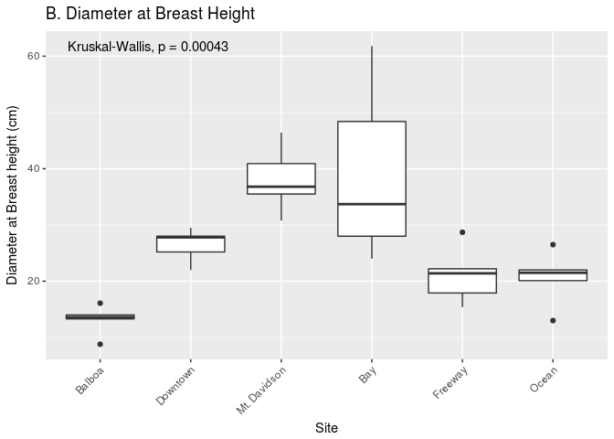

Urban biogeography of fungal endophytes across San Francisco
================
Emma Gibson
4/17/2018

-   [Abstract](#abstract)
-   [Introduction](#introduction)
-   [Methods](#methods)
    -   [Host Selection](#host-selection)
    -   [Sample Collection](#sample-collection)
    -   [Culturing](#culturing)
    -   [Molecular Methods](#molecular-methods)
    -   [Computational Methods](#computational-methods)
-   [Results](#results)
    -   [Isolation Frequency](#isolation-frequency)
    -   [Species richness](#species-richness)
    -   [NMDS Ordination](#nmds-ordination)
-   [Discussion](#discussion)
-   [Sources Cited](#sources-cited)
-   [Tables](#tables)
-   [Figures](#figures)

Abstract
========

In natural and agricultural systems, the plant microbiome —the microbial organisms associated with plant tissues—has been shown to have important effects on host physiology and ecology, yet we know little about how these plant-microbe relationships play out in urban environments. Here we characterize the composition of fungal communities associated with leaves of one of the most common sidewalk trees in the city of San Francisco, California. We focus our efforts on endophytic fungi (asymptomatic microfungi that live inside healthy leaves), which have been shown in other systems to have large ecological effects on the health of their plant hosts. Specifically, we characterized the foliar fungal microbiome of *Metrosideros excelsa* trees growing in a variety of urban environmental conditions. We used high-throughput culturing, PCR, and Sanger sequencing of the ITS nrDNA region to quantify the composition and structure of fungal communities growing within healthy leaves of 30 *M. excelsa* trees from 6 distinct sites, which were selected to capture the range of environmental conditions found within city limits. Sequencing resulted in over 900 high-quality ITS sequences. These sequences clustered into 88 Operational Taxonomic Units (97% VSEARCH OTUs). We found that these communities encompass relatively high alpha (within) and beta (between-site) diversity. Because the communities are all from the same host tree species, and located in relatively close geographical proximity to one another, these analyses suggest that urban environmental factors such as urban heat islands or differences in traffic density (and associated air quality) could potentially be influencing the composition of these fungal communities. We are performing additional analyses to quantify how urban abiotic and anthropogenic factors may shape the composition of these trees' endophytic microbiomes. These biogeographic patterns provide evidence that plant microbiomes in urban environments can be as dynamic and complex as their natural counterparts. As human populations continue to transition out of rural areas and into cities, understanding the factors that shape environmental microbial communities in urban ecosystems stands to become increasingly important.

Introduction
============

Although major cities and urban centers only cover a small portion the Earth's total geographic area, more than 50% of the human population lives in these urban centers, and the impact that these cities have on the environment can be seen worldwide (Schneider, Friedl, and Potere 2009). As people continue to move to urban environments, understanding the ecology of cities and urban settings will become critical to human health and wellbeing. Despite their comparatively small geographic size, the high density of human population in these environments makes them a unique combination of anthropogenic biotic and abiotic factors. Urban environments represent the convergence of humans from around the world, any plant or animal species those humans might have brough with them, and anthropogenic nonliving structures such as roads, sewers, and tall buildings, which all contribute to their unique ecology. Despite the unique complexity that these ecosystems present, they often overlooked by ecologists because more traditional ecology does not necesarily account for human factors, and humans influence is one of the driving factors of urban ecology (McDonnell and Niemelä 2011). Just as rural environments contain complex and dynamic ecosystems, the human and non-human aspects of large city habitats interact to creats a unique urban ecosystem. In recent years, ecologists have begun studying the urban environment just as they would a natural environment, in order to understand the novel environmental conditions this setting presents to the organisms that live there.

In this study, we focus on the urban ecology of trees in San Francisco, because trees potentially play a major role in shaping the ecosystem of a city. Just as the trees in a forest have a considerable impact on the climate and ecology of said forest, trees in cities have notable effects on a city's environment. For example, recent studies have shown that plant life in large cities can impact temperature, air quality, and other aspects of human health (Willis and Petrokofsky 2017). The urban heat island effect, which occurs when 'islands' of heat form as heat gets trappped between tall buildings, is one of the most well-documented unique urban anthropogenic environmental conditions. Trees in urban environments have been shown to have an impact on this effect, indicating that they can play ecological roles on urban environments that they do not play in nature, where said roles do not exist (Kong et al. 2014). Healthy trees in cities could also potentially benefit people who live outside the city in addition to the city's residents, because healthy plant life has been shown to improve urban air quality by taking up significant amounts of carbon dioxide from city air (Nowak et al. 2014). This finding indicates that the health of urban trees might not only be important to the health of those who live in a city, but to worldwide air quality as well, because the pollution generated in urban centers is one of the major contibuting factors to worldwide pollution (Alberti et al. 2003). Therefore, understanding the impact of urban environments on plant health could help to allow those plants to thrive, benefitting the human inhabitants of the city as well as the environment as a whole.

One potentially major factor influencing plant health that has yet to be studied in an urban environment in great detail its microbiome. Just as the emerging field of human microbiome study has revealed that symbiotic, nonpathogenic microbes can have major impacts on human health, plant life is also host to numerous symbiotic microbes. Similar to the human microbiome, the plant microbiome contains great diversity and is comprised of mulutiple distinct communities in various tissue systems such as the roots (rhizosphere), leaf surface (phylosphere), and leaf interior (endosphere) (Turner, James, and Poole 2013). While all of these systems could contain interesting community ecology patterns, here we focus on the microbial ecology of fungal microorganisms living in the endosphere.

Although some of these fungal microbes may be latent pathogens or decomposers waiting for the leaf to die, others are mutualists that may confer a benefit to their host. For instance, inoculation experiments have shown that specific species of endophytes can have an impact on their host’s overall health, including factors such as resistance and susceptibility to disease (Busby, Ridout, and Newcombe 2016).

In the wild, endophytic communities display species diversity comparable to that of any macroscopic community, even among individual trees from the same species (Gazis, Rehner, and Chaverri, n.d.). However, what factors influence this diversity and to what extent is still poorly understood. The urban setting is unique because factors such as rainfall and elevation will be less apparent in a smaller geographic area, but new factors such as proximity to roads and tall buildings may introduce effects of their own. Studies of suburban forests in Japan have indicated that an urban setting has a notable impact on endophytic diversity (Matsumura and Fukuda 2013). However, the full impact of urban environmental factors on endophytic communities has yet to be completely understood.

In this study, used culturing and barcode gene sequencing to identify the species makeup of endophytic communities in *Metrosideros excelsa* throughout San Francisco to relate environmental factors with fungal community composition. When studying this organism's microbiome in an urban environment, we expected to find that urban environmental factors such as pollution and tall buildings played a role in shaping the composition of these endophytic communities.

Methods
=======

Host Selection
--------------

We used the Urban Forest Map, which documents the location and species of every tree in San Francisco, to choose unique locations around the city with enough *Metrosideros excelsa* individuals (Figure 1). *Metrosideris excelsa* was an ideal species to choose for this study because it is widely planted throughout San Francsico, which indicates that it likely has a major impact on the urban environment, and that we would be able to obtain samples from a large number of trees in a variety of locatiouns throughout the city. In a related Hawaiian species, *Metrosideros polymorpha*, the species makeup of fungal endophyte communities has been shown to vary greatly with environmental factors such as elevation and rainfall (Zimmerman and Vitousek 2012). Although *M. excelsa's* endophytic communities have ben characterized in its native home of New Zealand, there have been few studies about these communities outside of its native environment or in an urban setting (McKenzie, Buchanan, and Johnston 1999).

Sample Collection
-----------------

We collected small branches from 5 trees in each of these sites using a clipper pole, collected at least 3 sun-facing outer branches from each tree. Because *M. excelsa* is an evergreen tree, and the newer leaves contain less fungi, we only collected branches that contained dark green leaves that appeared to be at least one year old. We collected samples on two days; once on April 2 2017, and once on August 26 2017. The first round of sampling only included 4 trees per site, and only included the Balboa, downtown, and Mt. Davidson sites. The second round of sampling included re-sampling the same trees from the first round, plus three new sites (the bay, the ocean, and the freeway) and an additional tree from each of the original sites. For both rounds of sampling, we collected all samples on the same day. to ensure that weather and season would not have an impact on the microbial community composition.

Culturing
---------

After we brought the branches back, we selected a subset of dark green asymptomatic leaves to culture fungi from. We surface-sterilized the leaves by first rinsing them with distiled water to remove any dirt, then rinsing them in a petri dish with 95% ethanol for 10 seconds, 10% NaOCl for 2 minutes, then 70% ethanol for another 2 minutee, emptying the dish beween rinses and leaving it closed until inside a biosafety cabinet after the last rinse. Then we cut the leaves into small (around 2mm) pieces and put them into slant tubes filled with malt extract agar (MEA). We used MEA because it is considered the standard media for isolating the largest variety of fungal species. For each tree, we prepared 6 leaves and made 100 tubes, except for the trees from the downtown site. For these trees, we prepared 150 tubes per tree because they had low isolation frequencies in our preliminary sampling. All leaves were prepared this way within 48 hours of the initial leaf sampling, to prevent death of the leaf tissue from altering the fungal community composition.

After two weeks, we evaluated them for fungal growth and subcultured the fungi from tubes with growth onto 35mm MEA in order to better evaluate their morphotypes and accumulate sufficient tissue for future barcode gene sequencing and voucher preparation. We re-evaluated and subcultured these tubes another week later to find any late-growing fungi.

Molecular Methods
-----------------

We extracted DNA from the fungal cells using a bead-beater and the Extract ‘n Amp DNA extraction kit. First, we added fungal tissue to sterile tubes filled with small beads, then added 100 μL Extract 'n' Amp DNA extraction solution. Next, we put the tubes in the bead-beater for one minute, which vigorously shook the tubes so that the zirconium oxide beads inside could physically ground up the fungal tissue. This step is necessary in fungal DNA extractions because fungi have cell walls, which are difficult for extraction solution to break up without this physical grinding step. Next, the samples were placed on heat blocks at 95°C for 10 minutes. After the heating step, we added a dilution buffer to each tube and stored them in a refrigerator to prevent degradation until PCR.

We performed PCR on the ITS region, a commonly-accepted fungal barcode gene, using the ITS1F forward primer and ITS4 reverse primer. For each PCR reaction, we used 1 μL of template DNA, 10 μL Extract ‘n Amp Taq polymerase, 6.4 μL PCR-grade water, 1 μL bovine serum albumin, 0.8 μL ITS1F forward primer, and 0.8 μL ITS4 reverse primer. For the PCR reaction, we used a BioRAD T100 thermal cycler with the following 35-repeat heat cycle: 95°C for 3 minutes, 95°C for 30 seconds, 54°C for 30 seconds, 72°C for 30 seconds, repeat steps 2-4 34 times, 72°C for 10 minutes, and then infinite hold at 4°C. To ensure that the fungal DNA successfully amplified, and that the master mix was not contaminated, we ran 5 μL of each sample on a 1% agarose gel with 1X Tris-acetate-EDTA (TEA) buffer and SYBR Safe, which ran at 120 volts for 20 minutes. Successful PCR samples with clean negative controls were kept at 4°C until sequencing preparation.

To prepare successful samples for sequencin, they were first cleaned with 1 μL Shrimp Alkaline Phopsphatase Exonuclease (ExoSap) per sample. To clean the samples, we used the following cycle on the same BioRAD T100 thermal cycler: 37°C for 15 minutes, 80°C for 15 minutes, then infinite hold at 4°C. After cleaning, samples were kept at 4°C until they were ready to be sent for sequencing. Directly before being sent for sequencing, cleaned samples that showed bright bands on their gels were diluted with an additional 15 μL PCR water before sequencing, although a small number of samples that had faint bands on the gels were not diluted this way. Cleaned samples were sent to MCLabs for Sanger sequencing.

Computational Methods
---------------------

We analyzed the data using three tools: Geneious, Mothur, and the R programming language. We used Geneious to manually clean and trim the Sanger sequencing data, and to identify and remove failed and low-quality sequences (Kearse et al. 2012). Sanger sequence quality was determined using Geneious's chromatogram, and sequences that appeared to have multiple strong signals were discarded because they likely came from a mixed culture and represented two individuals. Usable sequences were cleaned by trimming the ends with low-quality reads, clarifying any ambiguity codes, and resolving dye blobs.

We used Mothur to determine Operational Taxonomic Units (OTUs), which are groups of sequences categorized together based on similarity. Next, we used R to analyze the resulting OTU table. This included using the ‘vegan’ package to run and plot a Non-Metric Multidimensional Scaling (NMDS) ordination, a non-parametric technique used to visualize high-dimensional community data in only two dimensions. We used vegan (Oksanen et al. 2018) to calculate PERMANOVA values in order to prove that observed patterns were significant.

Because ITS1 has a lot of variation and is therefore difficult to construct phylogenies with, we used the Tree-Based Alignment Selector (TBAS) toolkit to construct a phylogeny and assign taxonomies to the data (Carbone et al. 2017). This toolkit matches unknown ITS sequences to the most similar ITS sequences in a large multi-gene phylogeny of confidently-assigned taxa.

Results
=======

Overall, we found a great amount of diversity in several aspects of these endophytic communities, including number of fungal isolates, species diversity, and community composition. While some communities showed a low number of fungal isolates, species richness analyyses showed that in nearly all of the microbial communities analyzed, our sampling did not encompas the complete microbial diversity within these microbiomes. While the species diversity within some sites exceeds 20 OTUs, there appears to be greater species diversity in these endophytic communities than this study was able to document. Furthermore, the taxonomic variation between different sites is also considerable, as there is no taxa that dominates all sites, although there are several taxa that show a degree of prominence in all sites.

Isolation Frequency
-------------------

The isolation frequency, or the percentage of leaf pieces that yielded fungal isolates, varied considerably between sites (Figure 2 A.). In most sites, the isolation frequency also varies between trees, especially in the Bay site. Trees within the Bay site also show the greatest variation in diameter at breast height (DBH) (Figure 2 B.). The only site that does not show as consistent variation in isolation frequency is the Downtown site, which is also the site with the smalles isolation frequencies.

Species richness
----------------

The species richness curve graphs the number of fungal species (OTUs) found versus the totla number of fungal isolates for each tree's microbiome. Each line represents one tree's community, and the color of the line represents which site each tree was located in. A sharply angled line indicates that the full species diversity has not been samples, and a line that plateaus indicated that most of the species available in that community have been sampled. There were 88 total OTUs found among the 30 different trees. Both isolation frequency and number of fungal species found varies notably between trees.

The most abundant fungal class among all communities is Dothideomycetes, followed by Sordariomycetes, which each had over 300 sequences. (Table 1). The most prominent taxa in each site vary considerably between sites. *Dothideomycetes*, the largest class within the ascomycetes, appears to predominate the microbiomes of most sites except for the Downtown and Bay sites. In both of these sites, *Sordariomycetes* is the most common class instead. There are several classes that are either absent or present in small numbers in most sites, but more abundant in one or several sites. For example, *Eurotiomycetes* are more common in the Downtown and Freeway sites, and *Leotiomycetes* is only abundant in the Mt. Davidson site.

NMDS Ordination
---------------

The similarities between microbial communities of these trees vary (Figure 5). Some sites show very little compositional similarity, while others cluster more tightly, indicating a greater degree of within-site beta diversity.

Discussion
==========

Overall, the microbial composition of these urban trees' leaves varies in many aspects, from number of fungal isolates to the identities of said isolates. This variation could be explained by numerous environmental factors, as well as host physiological factors, such as the age and size of the tree. Each aspect of these complex microbimoes is likely influenced by several of these factors at once.

Both isolation frequency and DBH varied greatly from one site to the other, and some sites show considerable within-site differences in these factors as well. The trees in the bay show the greatest range in both isolation frequency and DBH (Figure 2 A and B), indicating that the size of a tree may have a corelation with the number of fungal endophytes found within its leaves. Just as it shows the greatest range of isolation frequencies and tree sies, the Bay site also has some of the least similarity between its fungal communities on the NMDS ordination (Figure 5). The two trees with vastly different communities are also the smallest, and therefore likely youngest (Figure 5). In this instance, it appears that the size of the trees has the largest impact on the endophytic communities. Furthermore, the trees in the Mt. Davidson site, which have some of the most similar communities (Figure 5), also have fairly large trees with similar DBH. The fact that these trees have similar sizes in addition to similar community composition indicates that host size may have an impact on endophytic comunity composition.

However, it may be more likely that the sites that show great within-site diversity simply appear that way due to random sampling error. Although the Balboa site appears to have a high isolation frequency (Figure 2 A), many of the slant tubes that showed fungal growth failed to grow into a larger culture, leading to a low number of usable sequences (Figure 3). This low number of sequences per tree may indicate that the divergence in community composition that appears to be present might be due to the low sample size, rather than actual diference between the microbial communities between the Balboa trees (Figure 5). That said, it is still possible that the size of the trees might have an impact on the size of the endophytic communities. The Mt. Davidson trees have a larger median and range of DBH than the ocean or freeway trees (Figure 2 B.), and also have a higher median isolation frequency, which could indicate that trees with a larger DBH may also have a higher number of fungal endophytes.

Although there appears to be a general pattern with larger trees hosting a greater number of fungal endophytes, DBH cannot explain all of the variation in isolation frequencies, as demonstrated by the Downtown and Balboa sites. Although the trees from the downtown site have a larger median DBH (Figure 2 B.), the trees from the Balboa site have considerably more endophytes (Figure 2 A.), which demonstrates that larger trees do not necesarily have a higher number of fungal endophytes. In such cases, it is likely that environmental factors play a key role in shaping the endophytic communities of these trees. While the impact of environmental factors may be less evident when considering the number of fungal endophytes in a tree's microbiome, it becomes more apparent when looking at the identities of these endophytes. The composition of these communities can vary greatly among trees with similar isolation frequencies, as demonstrated by the taxonomic composition of the Mt. Davidson and bay sites (Figure 4). In general, there was more compostitional similarity between trees from the same location than between trees of a similar size (Figure 5).

These findings indicate that the endophytic microbiomes of urban trees are complex and diverse, and may show a degree of biogeographic structure that reflects their natural counterparts. Additionally, it is likely that urban environmental factors play a considerable role in shaping the endophytic communities of these trees. Most of the trees within the same site cluster together on the NMDS ordination, and although some communities show much greater within-site diversity than others, the general pattern suggests a notable degree of biogeographic structure (Figure 5). Similarly, sites that cluster closer together are typically geographically close together, such as how the Ocean and Balboa sites overlap, but not the Balboa and Downtown sites (Figure 5). This suggests that disperal mechanisms and/or common environmental factors may be shaping these community compositions. However, disperal alone does not sufficiently explain the compositional similarity of the downtown and freeway sites cluster together despite being fairly distant geographically (Figure 1). This indicates that these sites share a common environmental factor that shapes their communities, such as traffic and polution levels.

This study has demonstrated that the urban endophytic microbiome contains a great amount of diversity and appears to be influenced by unique urban environmental factors. Nearly all of the species accumulation curves indicate that the full diversity of these endophytic communities has yet to be sampled (Figure 3). Even in the small geographic area of San Francisco, we found notable trends in microbiome composition that appear to vary with uniquely urban environmental factors, such as traffic. A combination of environmental factors and host physiology appear to be the driving force behind the diversity of these microbiomes. While it is difficult to determine the exact mechanisms that influence these communities, the amount of species diversity and biogeographic structure indicate that the foliar microbiomes of urban trees may be just as complex and dynamic as those of trees in nature, and warrant further study.

Sources Cited
=============

Alberti, Marina, John M Marzluff, Eric Shulenberger, Gordon Bradley, Clare Ryan, and Craig Zumbrunnen. 2003. “Integrating Humans into Ecology: Opportunities and Challenges for Studying Urban Ecosystems.” *AIBS Bulletin* 53 (12). American Institute of Biological Sciences: 1169–79.

Busby, Posy E., Mary Ridout, and George Newcombe. 2016. “Fungal Endophytes: Modifiers of Plant Disease.” *Plant Molecular Biology* 90 (6): 645–55. doi:[10.1007/s11103-015-0412-0](https://doi.org/10.1007/s11103-015-0412-0).

Carbone, Ignazio, James B. White, Jolanta Miadlikowska, A. Elizabeth Arnold, Mark A. Miller, Frank Kauff, Jana M. U’Ren, Georgiana May, and François Lutzoni. 2017. “T-Bas: Tree-Based Alignment Selector Toolkit for Phylogenetic-Based Placement, Alignment Downloads and Metadata Visualization: An Example with the Pezizomycotina Tree of Life.” *Bioinformatics* 33 (8): 1160–8. doi:[10.1093/bioinformatics/btw808](https://doi.org/10.1093/bioinformatics/btw808).

Gazis, Romina, Stephen Rehner, and Priscila Chaverri. n.d. “Species Delimitation in Fungal Endophyte Diversity Studies and Its Implications in Ecological and Biogeographic Inferences.” *Molecular Ecology* 20 (14): 3001–13. doi:[10.1111/j.1365-294X.2011.05110.x](https://doi.org/10.1111/j.1365-294X.2011.05110.x).

Kearse, Matthew, Richard Moir, Amy Wilson, Steven Stones-Havas, Matthew Cheung, Shane Sturrock, Simon Buxton, et al. 2012. “Geneious Basic: An Integrated and Extendable Desktop Software Platform for the Organization and Analysis of Sequence Data.” *Bioinformatics* 28 (12): 1647–9. doi:[10.1093/bioinformatics/bts199](https://doi.org/10.1093/bioinformatics/bts199).

Kong, F, H Yin, P James, LR Hutyra, and HS He. 2014. “Effects of Spatial Pattern of Greenspace on Urban Cooling in a Large Metropolitan Area of Eastern China.” *Landscape and Urban Planning* 128. Elsevier: 35–47. doi:[10.1016/j.landurbplan.2014.04.018](https://doi.org/10.1016/j.landurbplan.2014.04.018).

Matsumura, Emi, and Kenji Fukuda. 2013. “A Comparison of Fungal Endophytic Community Diversity in Tree Leaves of Rural and Urban Temperate Forests of Kanto District, Eastern Japan.” *Fungal Biology* 117 (3): 191–201. doi:[https://doi.org/10.1016/j.funbio.2013.01.007](https://doi.org/https://doi.org/10.1016/j.funbio.2013.01.007).

McDonnell, Mark J, and J Niemelä. 2011. “The History of Urban Ecology.” *Urban Ecology*, 9.

McKenzie, E. H. C., P. K. Buchanan, and P. R. Johnston. 1999. “Fungi on Pohutukawa and Other Metrosideros Species in New Zealand.” *New Zealand Journal of Botany* 37 (2). Taylor & Francis: 335–54. doi:[10.1080/0028825X.1999.9512637](https://doi.org/10.1080/0028825X.1999.9512637).

Nowak, David J., Satoshi Hirabayashi, Allison Bodine, and Eric Greenfield. 2014. “Tree and Forest Effects on Air Quality and Human Health in the United States.” *Environmental Pollution* 193: 119–29. doi:[https://doi.org/10.1016/j.envpol.2014.05.028](https://doi.org/https://doi.org/10.1016/j.envpol.2014.05.028).

Oksanen, Jari, F. Guillaume Blanchet, Michael Friendly, Roeland Kindt, Pierre Legendre, Dan McGlinn, Peter R. Minchin, et al. 2018. *Vegan: Community Ecology Package*. <https://CRAN.R-project.org/package=vegan>.

Schneider, Annemarie, Mark A Friedl, and David Potere. 2009. “A New Map of Global Urban Extent from Modis Satellite Data.” *Environmental Research Letters* 4 (4). IOP Publishing: 044003.

Turner, Thomas R, Euan K James, and Philip S Poole. 2013. “The Plant Microbiome.” *Genome Biology* 14 (6). BioMed Central: 209.

Willis, Katherine J., and Gillian Petrokofsky. 2017. “The Natural Capital of City Trees.” *Science* 356 (6336). American Association for the Advancement of Science: 374–76. doi:[10.1126/science.aam9724](https://doi.org/10.1126/science.aam9724).

Zimmerman, Naupaka B., and Peter M. Vitousek. 2012. “Fungal Endophyte Communities Reflect Environmental Structuring Across a Hawaiian Landscape.” *Proceedings of the National Academy of Sciences* 109 (32). National Academy of Sciences: 13022–7. doi:[10.1073/pnas.1209872109](https://doi.org/10.1073/pnas.1209872109).

Tables
======

**Table 1.** Abundances of *Ascomycota* classe sacross all trees and sites.

| Fungal class    |  Number of sequences|
|:----------------|--------------------:|
| Dothideomycetes |                  450|
| Sordariomycetes |                  341|
| Eurotiomycetes  |                   57|
| Pezizomycetes   |                   52|
| Leotiomycetes   |                   19|

Figures
=======

\[\[\[\[\[\[\[construct map in r\]\]\]\]\]\]\]

**Figure 1.** A map of the locations sampled. The preliminary sampling in April of 2017 only included trees from the downtown, Mt. Davidson, and Balboa sites, and only 4 trees per site. The second sampling in August of 2017 included all 6 sites and 5 trees from each site, including a re-sampling of all 12 original trees.

**Figure 2.** Isolation frequencies (A) and tree diameters (B) at each site. Isolation frequency (A) is only shown for the August 2017 sampling, and is a measure of how many slant tubes showed signs of fungal growth, out of how many total slant tubes were made. 100 slant tubes were made for each tree except for the trees in the downtown site, which had 140 slant tubes per tree because they had low isolation frequencies during the initial sampling.

**Figure 3.** Species accumulation curve showing species richness in all sites for the August 2017 sampling. Each line represents the combined species richness of all trees in one site, and the color represents the site which said tree is from.

**Figure 4.** Normalized relative abundances of *Ascomycota* taxa in each site for the August 2017sampling.

*Figure 5.* NMDS ordination of community composition for the Augist 2017 sampling. Each point represents the endophytic community of one tree, and the size of the point corresponds to that tree's DBH, while the color of said point corresponds to the site that tree is from. Points that are closer together indicate that the trees they represent have similar comunity compositions. The ellipses show the standard error around the centroid of all points within a site, and are also color-coded according to which site they represent.
